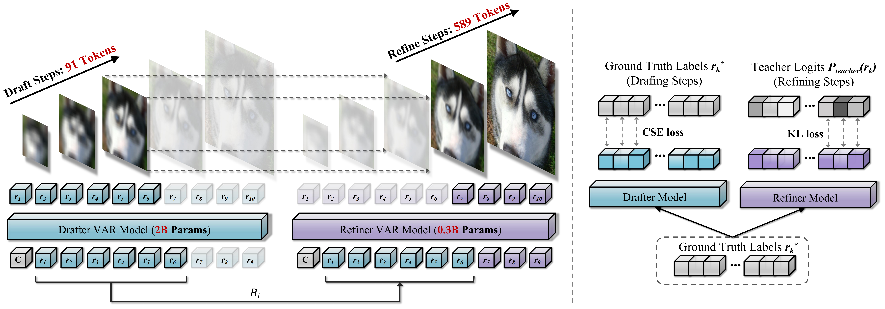

<div align="center">
<h1>🚀 CoDe: Collaborative Decoding Makes Visual Auto-Regressive Modeling Efficient</h1>

  <div align="center">
  <a href="https://opensource.org/license/mit-0">
    
  </a>
  <a href="https://arxiv.org/abs/2411.17787">
    
  </a>
  <a href="https://czg1225.github.io/CoDe_page/">
    
  </a>
  <a href="https://huggingface.co/Zigeng/VAR_CoDe">
    
  </a>
</div>
</div>

> **Collaborative Decoding Makes Visual Auto-Regressive Modeling Efficient**   
> [Zigeng Chen](https://github.com/czg1225), [Xinyin Ma](https://horseee.github.io/), [Gongfan Fang](https://fangggf.github.io/), [Xinchao Wang](https://sites.google.com/site/sitexinchaowang/)   
> [xML Lab](https://sites.google.com/view/xml-nus), National University of Singapore  
> 🥯[[Paper]](https://arxiv.org/abs/2411.17787)🎄[[Project Page]](https://czg1225.github.io/CoDe_page/) 

<!--  -->
<div align="center">
  </img>
  </img>
  <br>
  <em>
      1.7x Speedup and 0.5x memory consumption on ImageNet-256 generation. Top: original VAR-d30; Bottom: CoDe N=8. Speed ​​measurement does not include vae decoder
  </em>
</div>
<br>

## 💡 Introduction
We propose Collaborative Decoding (CoDe), a novel decoding strategy tailored for the VAR framework. CoDe capitalizes on two critical observations: the substantially reduced parameter demands at larger scales and the exclusive generation patterns across different scales. Based on these insights, we partition the multi-scale inference process into a seamless collaboration between a large model and a small model. This collaboration yields remarkable efficiency with minimal impact on quality: CoDe achieves a 1.7x speedup, slashes memory usage by around 50%, and preserves image quality with only a negligible FID increase from 1.95 to 1.98. When drafting steps are further decreased, CoDe can achieve an impressive 2.9x acceleration, reaching over 41 images/s at 256x256 resolution on a single NVIDIA 4090 GPU, while preserving a commendable FID of 2.27.



### 🔥Updates
* 🎉 **Feburary 27, 2025**: CoDe is accepted by CVPR 2025!
* 🔥 **November 28, 2024**: Our paper is available now!
* 🔥 **November 27, 2024**: Our model weights are available at 🤗 huggingface [here](https://huggingface.co/Zigeng/VAR_CoDe)
* 🔥 **November 27, 2024**: Code repo is released! Arxiv paper will come soon!


## 🔧 Installation

1. Install `torch>=2.0.0`.
2. Install other pip packages via `pip3 install -r requirements.txt`.


## 💻  Model Zoo
We provide drafter VAR models and refiner VAR models, which are on <a href='https://huggingface.co/Zigeng/VAR_CoDe'></a> or can be downloaded from the following links:

| Draft step | Refine step |reso. |   FID | IS | Drafter VAR🤗 | Refiner VAR🤗|
|:----------:|:-----------:|:----:|:-----:|:--:|:-----------------:|:----------------:|
| 9 steps| 1 steps|   256   |    1.94    |296    | [drafter_9.pth](https://huggingface.co/Zigeng/VAR_CoDe/resolve/main/drafter_9.pth) |[refiner_9.pth](https://huggingface.co/Zigeng/VAR_CoDe/resolve/main/refiner_9.pth) |
| 8 steps| 2 steps|   256   |    1.98    |302    | [drafter_8.pth](https://huggingface.co/Zigeng/VAR_CoDe/resolve/main/drafter_8.pth) |[refiner_8.pth](https://huggingface.co/Zigeng/VAR_CoDe/resolve/main/refiner_8.pth) |
| 7 steps| 3 steps|   256   |    2.11    |303    | [drafter_7.pth](https://huggingface.co/Zigeng/VAR_CoDe/resolve/main/drafter_7.pth) |[refiner_7.pth](https://huggingface.co/Zigeng/VAR_CoDe/resolve/main/refiner_7.pth) |
| 6 steps| 4 steps|   256   |    2.27    |397    | [drafter_6.pth](https://huggingface.co/Zigeng/VAR_CoDe/resolve/main/drafter_6.pth) |[refiner_6.pth](https://huggingface.co/Zigeng/VAR_CoDe/resolve/main/refiner_6.pth) |


Note: The VQVAE [vae_ch160v4096z32.pth](https://huggingface.co/FoundationVision/var/resolve/main/vae_ch160v4096z32.pth) is also needed.


## ⚡ Inference

### Original VAR Inference:
```python
CUDA_VISIBLE_DEVICES=0 python infer_original.py --model_depth 30
```

### 🚀  Training-free CoDe:
```python
CUDA_VISIBLE_DEVICES=0 python infer_CoDe.py --drafter_depth 30 --refiner_depth 16 --draft_steps 8 --training_free 
```

### 🚀  Speciliazed Fine-tuned CoDe:
```python
CUDA_VISIBLE_DEVICES=0 python infer_CoDe.py --drafter_depth 30 --refiner_depth 16 --draft_steps 8
```
* `drafter_depth`: The depth of the large drafter transformer model.
* `refiner_depth`: The depth of the small refiner transformer model.
* `draft_steps`: Number of steps for the drafting stage.
* `training_free`: Enabling training-free CoDe or inference with specialized finetuned CoDe.

## ⚡ Sample & Evaluations
### Sampling 50000 images (50 per class) with CoDe
```python
CUDA_VISIBLE_DEVICES=0 python sample_CoDe.py --drafter_depth 30 --refiner_depth 16 --draft_steps 8 --output_path <img_save_path>
```
The generated images are saved as both `.PNG` and `.npz`. Then use the [OpenAI's FID evaluation toolkit](https://github.com/openai/guided-diffusion/tree/main/evaluations) and reference ground truth npz file of [256x256](https://openaipublic.blob.core.windows.net/diffusion/jul-2021/ref_batches/imagenet/256/VIRTUAL_imagenet256_labeled.npz) to evaluate FID, IS, precision, and recall.


## 🚀 Visualization Results
### Qualitative Results

### Zero-short Inpainting&Editing (N=8)


## Acknowlegdement
Thanks to [VAR](https://github.com/FoundationVision/VAR) for their wonderful work and codebase!

## Citation
If our research assists your work, please give us a star ⭐ or cite us using:
```
@misc{2411.17787,
Author = {Zigeng Chen and Xinyin Ma and Gongfan Fang and Xinchao Wang},
Title = {Collaborative Decoding Makes Visual Auto-Regressive Modeling Efficient},
Year = {2024},
Eprint = {arXiv:2411.17787},
}
```
